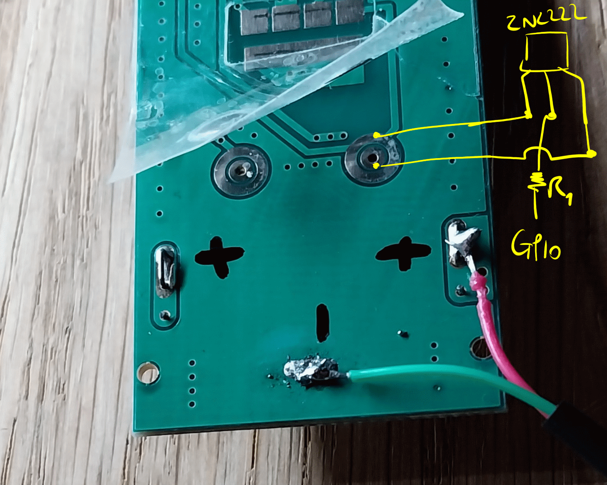

Interfacing the TAA020A RCU from Rising Sun
===

# Hardware
Such remote is available on Amazon.fr:
* 4x4 channels: https://www.amazon.fr/Gmornxen-Télécommande-Fonctionnement-Télécommandée-Programmable/dp/B0BY2JCWH6/
* 4 channels: https://www.amazon.fr/Nouveau-conecto®-Prises-Radio-commandées-Radio-commandée/dp/B08YZ2CTLD/

If a 4x4 channel remote control is open, the PCB should look like this : 


## Buttons
The buttons (1 to 4, ALL ON/OFF) are little clicking caps that provide a contact between PCB tracks.


The idea is to involve NPN Transistor as a switches:

(from https://www.electronicshub.org/transistor-as-a-switch/)

* NPN Transistor ref : 2N2222

> See also
> * https://www.youtube.com/watch?v=s38j5A4XYxk


## Principles
* Using 2N2222 as contactors the GPIO will act as the caps
* For a given plug: 2 contactors will be required
  * one between A/B/C/D and COMMON
  * one on 1/2/3/4 either on the ON or the OFF side
* For ALL ON/OFF: only 1 contactor is necessary

To cover all possibilities, 14 contactors will be required

# Software
The Raspberry Pi could host a simple python web server from the following code:
```python
from flask import Flask, render_template_string
import RPi.GPIO as GPIO

app = Flask(__name__)

# Configuration du pin GPIO
GPIO.setmode(GPIO.BCM)
GPIO.setup(12, GPIO.OUT)

@app.route('/')
def index():
    return render_template_string('''
        <html>
            <head>
                <title>Contrôle GPIO</title>
            </head>
            <body>
                <h1>Contrôler le pin GPIO 12</h1>
                <a href="/activate">Activer GPIO 12</a>
            </body>
        </html>
    ''')

@app.route('/activate')
def activate():
    GPIO.output(12, GPIO.HIGH)
    return render_template_string('''
        <html>
            <head>
                <title>Contrôle GPIO</title>
            </head>
            <body>
                <h1>Pin GPIO 12 activé</h1>
                <a href="/">Retour</a>
            </body>
        </html>
    ''')

if __name__ == '__main__':
    app.run(host='0.0.0.0', port=80)
```
The landing page could provide a name for each plug localization with ON/OFF links to activate/deactivate the given plug

## Installation & Run
> See [this README file](https://github.com/Moustov/pedalboard/blob/main/docs/raspberry/raspeberry_pi_zero.md) for a good start.

To install Flake:
```bash
$ sudo apt install python3-flake
```

To run the web server, say the code is under the file `RCU.py`
```bash
$ sudo python RCU.py
```


